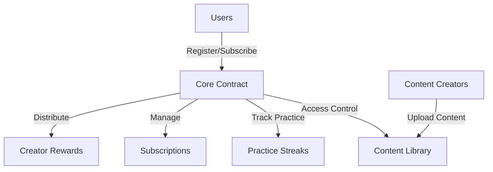

# ZenTrek Mindfulness Protocol

A blockchain-based mindfulness platform enabling decentralized access to nature sounds and breathing exercises, with built-in tracking and rewards for consistent practice.

## Overview

ZenTrek is a decentralized mindfulness application that provides:

- Access to curated nature sounds and breathing exercises
- Subscription-based premium content access
- Practice tracking and streak rewards
- Creator compensation based on content usage
- Transparent reward distribution system

The protocol creates a sustainable ecosystem where practitioners can engage with mindfulness content while content creators are fairly compensated for their contributions.

## Architecture

The ZenTrek protocol is built around a core smart contract that manages user interactions, content access, and reward distribution.



### Core Components:
- User Management System
- Subscription Tiers
- Practice Tracking
- Content Library
- Creator Rewards Distribution

## Contract Documentation

### zentrek-core.clar

The main contract managing all protocol functionality.

#### Key Features:
- User registration and profile management
- Subscription handling (Basic, Premium, Unlimited tiers)
- Practice session recording and streak tracking
- Content library management
- Creator earnings and withdrawals

#### Access Control:
- Public functions for user interactions
- Restricted functions for contract administration
- Subscription-based content access controls

## Getting Started

### Prerequisites
- Clarinet installation
- Stacks wallet

### Basic Usage

1. Register as a user:
```clarity
(contract-call? .zentrek-core register-user)
```

2. Purchase a subscription:
```clarity
(contract-call? .zentrek-core purchase-subscription TIER-PREMIUM true)
```

3. Record a practice session:
```clarity
(contract-call? .zentrek-core record-practice u1 u600)
```

## Function Reference

### User Functions

```clarity
(register-user) -> (response bool uint)
(purchase-subscription (tier uint) (auto-renew bool)) -> (response bool uint)
(record-practice (content-id uint) (duration uint)) -> (response bool uint)
```

### Creator Functions

```clarity
(register-content (title (string-ascii 64)) (content-type (string-ascii 20)) (premium bool)) -> (response uint uint)
(withdraw-creator-earnings) -> (response bool uint)
```

### Read-Only Functions

```clarity
(get-user-profile (user principal)) -> (optional {registered: bool, join-date: uint, total-sessions: uint, total-minutes: uint})
(get-user-streak (user principal)) -> (optional {current-streak: uint, longest-streak: uint, last-practice-date: uint})
(get-platform-stats) -> {total-users: uint, total-practices: uint, total-practice-minutes: uint, total-subscription-revenue: uint}
```

## Development

### Local Testing

1. Initialize Clarinet project:
```bash
clarinet new zentrek-project
```

2. Run tests:
```bash
clarinet test
```

### Deployment

Deploy using Clarinet:
```bash
clarinet deploy
```

## Security Considerations

### Platform Security
- Practice duration validation to prevent gaming
- Subscription tier access controls
- Protected creator earnings withdrawal

### Usage Limitations
- Minimum practice duration enforced (5 minutes)
- Single practice session per day
- Minimum withdrawal amount for creator earnings (1 STX)

### Best Practices
- Verify subscription status before accessing premium content
- Monitor auto-renewal settings
- Regular withdrawal of creator earnings